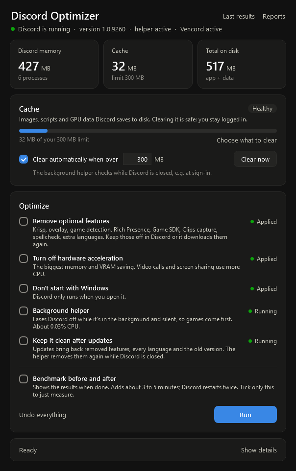

# Discord Optimizer

### [⬇ Download the latest release](https://github.com/RiddleTheWorld/discord-optimizer/releases/latest)

> **A personal project.** I made this for my own PC and put it up in case it's useful to someone else.
> It's shared as is: it works on my setup, but there's no support or update schedule.

Makes the official Discord desktop app on Windows use less RAM, VRAM, CPU and disk, and keeps its cache in check.
It changes Discord's settings and files from the outside; it never modifies Discord's code. Everything can be undone.



*Not affiliated with or endorsed by Discord Inc.*

## Get started

1. Download the zip from the [latest release](https://github.com/RiddleTheWorld/discord-optimizer/releases/latest) and
   extract it into a folder you'll keep (or clone this repository). Keep the files together.
2. Double-click **Start Discord Optimizer.cmd**.
   If Windows says "Windows protected your PC", choose **More info → Run anyway** (it says that about any downloaded script).
3. Tick what you want and press **Run**. Tick **Benchmark before and after** to see what it saved (adds 3 to 5 minutes).

Requirements: Windows 10 or 11 and the regular Discord app from discord.com (Discord, PTB and Canary all work).
Nothing else to install: it uses the Windows PowerShell and .NET that come with Windows.

## What it does

| Option | Effect |
|---|---|
| Remove optional features | Removes Krisp noise suppression, the in-game overlay, game detection, Rich Presence, the Game SDK bridge, Clips capture and spellcheck, plus extra language packs, old versions and logs. Modules are backed up so Undo can restore them |
| Turn off hardware acceleration | The biggest memory and VRAM saving. Video calls and screen sharing use more CPU instead |
| Don't start with Windows | Removes Discord's autostart entry |
| Background helper | A small companion program (not injected into Discord). While Discord is in the background and silent, it puts Discord in Windows efficiency mode with lower CPU and memory priority. It switches back the moment you focus Discord or any Discord audio plays. Costs about 0.03% of one CPU core |
| Keep it clean after updates | The helper removes the features, languages and old versions that Discord updates bring back, while Discord is closed |

**Cache.** The window shows Discord's cache size against a limit you set. **Clear now** clears the areas you pick, and
**Clear automatically** lets the helper clear the cache while Discord is closed whenever it goes over the limit.
You stay logged in: login data, settings and local storage are never touched.

| Cache area | Contains | Ticked by default |
|---|---|---|
| Images and media | Pictures, GIFs, avatars and emoji. Can grow to several GB | Yes |
| GPU shader cache | Discord's own copy (the shader caches Windows and your graphics driver share with games are never touched) | Yes |
| Logs and crash reports | Discord logs, crash reports, voice debug recordings, Windows crash dumps for Discord | Yes |
| Other browser data | Video playback stats and Chromium housekeeping databases | Yes |
| Updater leftovers | Old versions, partial update downloads, setup logs | Yes |
| Compiled scripts | Makes the next start slower; only worth clearing if Discord misbehaves | No |
| Installer package | Discord's ~140 MB installer copy (unverified whether its updater needs it) | No |
| Downloaded installers | `DiscordSetup.exe` files in your Downloads folder | No |

**Undo everything** restores the removed modules and hardware acceleration and removes the helper.

## Inside Discord

Discord downloads a removed feature again whenever you use it, and some settings only exist inside the app.
For the leanest setup, in Discord's User Settings:

- **Accessibility:** Reduced Motion on; GIF autoplay, animated emoji and sticker animation off
- **Chat:** embeds and link previews off; spellcheck off
- **Voice & Video:** Noise Suppression set to None or Standard (not Krisp); Advanced Voice Activity off;
  Debug Logging and Diagnostic Audio Recording off
- **Game Overlay, Clips, game activity sharing:** off
- **Streamer Mode:** automatic on/off disabled
- **Windows Settings:** Minimize to Tray off if you want closing the window to quit Discord

## Using it with Vencord

Works alongside [Vencord](https://vencord.dev). Vencord hooks into Discord's `resources` folder and keeps its plugins and
themes in `%APPDATA%\Vencord`; this tool touches neither, and cache clearing never removes Vencord's settings or themes.

- **After a Discord update** Vencord stops loading until you run its installer again and choose **Repair**. That's how
  Vencord works with every Discord update. The window shows **Vencord needs repair** when that happens.
- **Plugins that rely on a removed feature** (for example anything that needs game detection or the overlay) make
  Discord download that module again; with "Keep it clean" on, the helper removes it the next time Discord closes.
  Leave "Remove optional features" off if you depend on such a plugin.
- **Transparent or vibrancy themes** may need hardware acceleration on.
- Every plugin adds some memory and CPU; enabling only the ones you use keeps Discord lighter.
- Vencord is a client modification, which Discord's Terms of Service forbid. That's a choice for you to make;
  this tool works the same either way.

## Example results

One test PC (Discord 1.0.9260, Ryzen, 32 GB RAM, RX 9060 XT), Discord freshly started with its window open:

| | Before | After |
|---|---|---|
| RAM (Task Manager's "Memory") | 576 MB | 462 MB |
| VRAM | 148 MB | 0 MB |
| Disk | 650 MB | 512 MB |

Expect about ±15% difference between runs even with no changes, so treat single measurements as rough.

Tested and rejected: Chromium command-line flags (low-end device mode, V8 memory flags, merging processes) gave no
reliable gain, and Discord resets custom flags while running. "RAM cleaner" tools only make the number look smaller.

## Command line

Everything the window does is in `Optimize-Discord.ps1`:

```powershell
.\Optimize-Discord.ps1 -All -Benchmark       # apply everything, with a before/after report
.\Optimize-Discord.ps1 -All -WhatIf          # preview without changing anything
.\Optimize-Discord.ps1 -ClearCache -Areas Media,Logs,Code
.\Optimize-Discord.ps1 -Governor -ClearCacheAboveMB 300 -Maintain
.\Optimize-Discord.ps1 -Restore              # undo
```

If PowerShell blocks scripts: `powershell -ExecutionPolicy Bypass -File .\Optimize-Discord.ps1 -All`

Reports, backups and the helper live in `%LOCALAPPDATA%\DiscordOptimizer`.

## Removing it

1. Press **Undo everything** in the window (or run `.\Optimize-Discord.ps1 -Restore`). This restores the modules and
   hardware acceleration, and stops and removes the background helper.
2. Delete `%LOCALAPPDATA%\DiscordOptimizer` (reports, backups, settings) and the folder you downloaded.

Discord's autostart stays off; turn it back on in Discord under Settings > Windows Settings > Open Discord.
Language packs and caches that were removed come back with Discord's next update or on their own.

## Files

| File | Purpose |
|---|---|
| `Start Discord Optimizer.cmd` | Double-click launcher |
| `DiscordOptimizerUI.ps1` | The window |
| `Optimize-Discord.ps1` | Does the work (the window runs it for every action) |
| `DiscordCommon.ps1` | Shared definitions (cache areas, optional modules), measurements and the HTML report |
| `DiscordGovernor.cs` | Source of the background helper, compiled on your PC when you install it, with the lists from `DiscordCommon.ps1` built in |

## Notes

- Some antivirus programs are wary of PowerShell scripts in general. Everything here is plain text you can read.
- Start it normally, not with "Run as administrator": a benchmark restarts Discord, and it would then run as administrator too.
- GPU and VRAM numbers can show as "—" on non-English Windows, where the GPU counter names are translated.
- Discord's Terms of Service forbid modified clients. This tool doesn't modify the client: it changes settings,
  removes optional downloadable modules and manages processes from outside, all of which Discord's own updater
  can restore.

## License

MIT, see [LICENSE](LICENSE). Discord is a trademark of Discord Inc.; this project is not affiliated with it.
